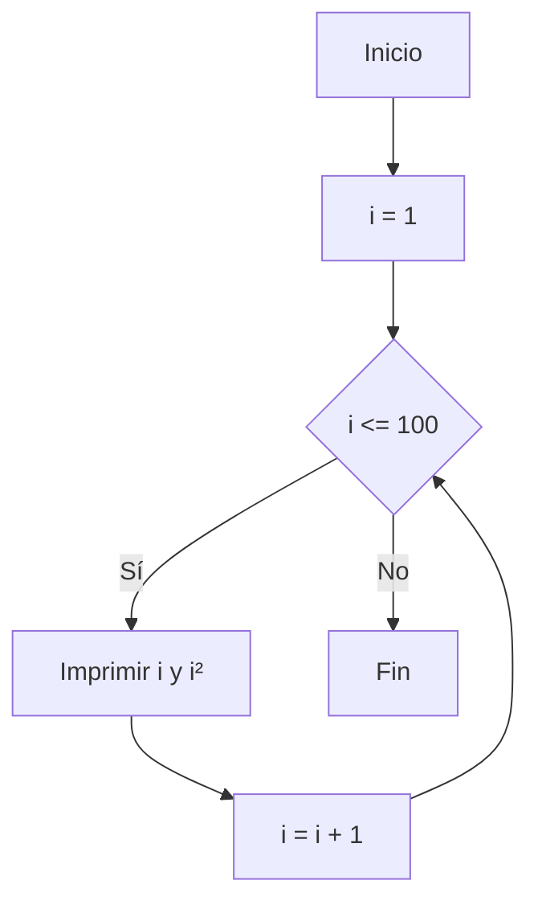
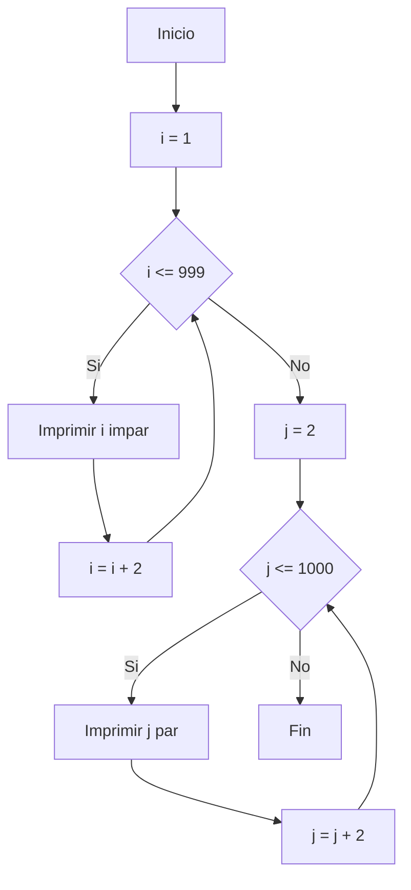
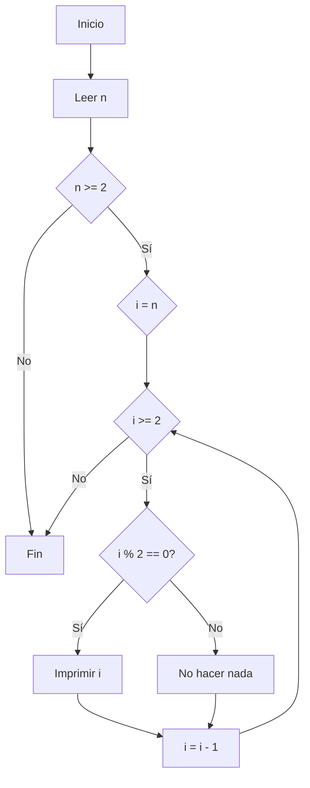

# Reto 6
## Ejercicio 1
Imprime los números del 1 al 100 junto con sus cuadrados
### Diagrama de flujo

### Programa en python
```python

numero = 1
while numero <= 100:
    cuadrado = numero * numero
    print("Numero:", numero, "-> Cuadrado:", cuadrado)
    numero = numero + 1
```
## Ejercicio 2
Imprimir un listado con los números impares desde 1 hasta 999 y seguidamente otro listado con los números pares desde 2 hasta 1000
### Diagrama de flujo

### Programa en python
```python

numero = 1
print("Numeros impares del 1 al 999:")
while numero <= 999:
    print(numero) 
    numero = numero + 2  
numero = 2
print("\n Numeros pares del 2 al 1000:")
while numero <= 1000:
    print(numero) 
    numero = numero + 2 

```
## Ejercicio 3
Imprimir los números pares en forma descendente hasta 2 que son menores o iguales a un número natural n ≥ 2 dado
### Diagrama de flujo

### Programa en python
```python
n = int(input("Ingresa un número natural mayor o igual que 2: "))

if n >= 2:
    i = n
    while i >= 2:
        if i % 2 == 0:
            print(i) 
        i = i - 1
else:
    print("El número debe ser mayor o igual que 2.")
```
## Ejercicio 4
Imprimir el factorial de un número natural n dado
### Programa en python
```python
n = int(input("Ingresa un número natural (n ≥ 0): "))

if n >= 0:
    factorial = 1
    i = 1
    while i <= n:
        factorial = factorial * i   
        i = i + 1  

    print("El factorial de", n, "es:", factorial)
else:
    print("Por favor, ingresa un numero natural (mayor o igual a 0).")
```
## Ejercicio 5
Implementar un programa que ingrese un número de 2 a 50 y muestre sus divisores
### Programa en python
```python
numero = int(input("Ingresa un número entre 2 y 50: "))

if 2 <= numero <= 50:
    print("Los divisores de", numero, "son:")
    
    i = 1
    while i <= numero:
        if numero % i == 0:
            print(i)  
        i = i + 1  
else:
    print("Por favor, ingresa un número válido entre 2 y 50.")
```
## Ejercicio 6
Implementar el algoritmo que muestre los números primos del 1 al 100. Nota: use funciones
### Programa en python
```python
def es_primo(n):
    if n < 2:
        return False  

    i = 2
    while i < n:
        if n % i == 0:
            return False  
        i = i + 1

    return True 

print("Números primos del 1 al 100:")
numero = 1
while numero <= 100:
    if es_primo(numero):
        print(numero)
    numero = numero + 1
```